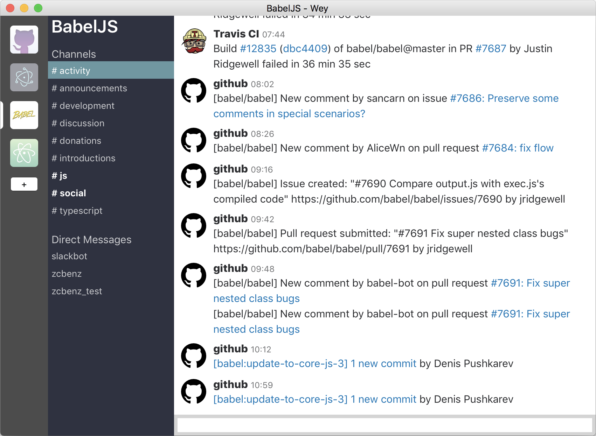

# Lounge Lizard

Fast open source desktop chat application, written in Node.js with native UI powered
by [the Yue library](https://github.com/yue/yue).

**Important Note:** Lounge Lizard is based on Wey (https://github.com/yue/wey) and has been modified 
from the original source (2019 - 2020).

__Do not use this for work, you might miss important messages due to bugs and
missing features.__

## Guide to additional documentation

* **[Known Issues](known-issues.md):** Documents known issues that must or should be addressed as part of any future work on Lounge Lizard. 
Some of the listed issues are bugs that have been identified while others are tasks that will need to be completed.

* **[Supported Features](supported-features.md):** Lists various features of a chat application and whether each is supported by this 
application and the chat services it supports.

* **[Teams](Teams.md):** Contains important information about Microsoft Teams, the Microsoft Graph API which this application uses to interact
with Microsoft Teams, and this application's support for Microsoft Teams.

## Screenshots

|  macOS                                   |  Linux                                     |  Windows                                       |
| ---------------------------------------- | ------------------------------------------ | ---------------------------------------------- |
|  | ![Linux screenshot][docs/linux-screen.png] | ![Windows screenshot][docs/windows-screen.png] |

## Releases

To find latest releases for different platforms, go to the [Releases][releases]
page on GitHub.

For hackers, you can also `npm install -g lounge-lizard`. (Currently only Node.js 10.x is
supported for running from source code.)

Because only Node.js 10.x is supported when running the application from source code, it is necessary to use a Node.js 10.x version to continue development of Lounge Lizard. The development team used and recommends Node.js 10.9.0.

### Running application from source on Windows

* Delete your current Node.js directory (usually located in C:\Program Files\nodejs), if one already exists.
* Delete your current npm directory (usually located in C:\Users\<User>\AppData\Roaming\npm), if one already exists.
* Use a Node.js version manager. Node Version Manager for Windows is recommended. 
* Go to https://github.com/coreybutler/nvm-windows/releases and download **nvm-setup.zip**.
* Unzip the file and run it.
* Open Windows PowerShell with administrative privileges.
* Run `nvm install 10.9.0`
* Run `nvm use 10.9.0`
* Now, in a terminal, go to the local repository and run `npm install` and `npm run-script build`
* Finally, to run the executable application, run `npm run start`

**Important note:** It is possible to run the application in either of two ways: using the executable file that was built above or using
`npm run start`.  When frequent code changes are being made, the latter is highly recommended as the application startup time using 
`npm run start` tends to be much shorter than the time to build the application executable file.

## Technical stack

* [Yue](https://github.com/yue/yue) - Cross-platform native UI library
* [Yode](https://github.com/yue/yode) - Node.js fork with GUI message loop
* [Yackage](https://github.com/yue/yackage) - Package Node.js project with Yode
* [Node.js](https://nodejs.org)

## Resources usage

Resources used by Lounge Lizard are based on following things:

* The Node.js runtime.
* Native windows and widgets.
* HTML view used for rendering messages.
* JavaScript code for communicating with Slack.
* Cached Users and messages information in teams.

Normally for multiple teams with heavy traffics, Lounge Lizard should not have any
significant CPU usage, and RAM usage is usually under 100MB. However if you
have a team with more than 10k users in it, the memory usage may increase a lot.

## Design principles

Lounge Lizard is developed with following principles, the ultimate goal is to provide a
fast and powerful chat app.

### Use native UI for almost everything

Most parts of Lounge Lizard should be created with native UI widgets from Yue library,
when there is need for custom UI, draw it manually.

### HTML is our friend

Webview is a great tool as long as we use it wisely. For rendering the rich
messages of Slack, HTML is the best tool.

The HTML pages showed in Lounge Lizard should be static for best performance, the usage
of JavaScript in the pages must be minimal. We should not use any external CSS
or JavaScript library/framework, every style and animation must be hand written.

### Minimal dependencies

Be careful when adding dependencies, only use third party modules that are small
and without tons of dependencies.

### Hide details of chat service providers

Lounge Lizard currently supports Slack and Microsoft Teams.  In the future, it could
support more services or could support plugins to add arbitrary services.

To achieve this we must ensure the views and controllers must only operate on
the public interfaces of models, all internal implementations must be hidden
from outside.

### Separated views

Lounge Lizard supports multiple windows with different types for reading messages, so the
views should act only as users of models, and should not manage the models.

As benefit creating views in Lounge Lizard is very fast, opening a new window is almost
as fast as showing a hidden window. Users can close all windows and run Lounge Lizard in
background, while still be able to open a new window quickly.

### Correctly unload things

While JavaScript has garbage collections, it is still very easy to cause memory
leaks when careless referencing objects together. Views in Lounge Lizard are reloaded
frequently (for example switching accounts and closing windows), so it is
important to ensure everything event subscription is detached when unloading
a view.

## Contributions

Please limit the size of pull requests under 300 lines, otherwise it would be
rather hard to review the code. If you have a big feature to add, please
consider splitting it into multiple pull requests.

It is also encouraged to fork this project or even develop commercial apps based
on this project, as long as you follow the GPLv3 license.

## Performance bottleneck

In Lounge Lizard most time are spent on networking, especially on startup when fetching
channels information from Slack, and performance is usually limited by
Slack's APIs.

### Most operations are done via web API

In Slack while there is Real Time Messaging API, most common operations can only
be done via web APIs, i.e. by sending HTTPS requests, and it is really slow.

### Messages do not include user information

The messages history we pulled from Slack does not include full user
information, it only has user IDs in it. So in order to render the messages we
have to pull users list first.

However certain Slack teams have more than 20k users, and it is impossible to
download all users' information and cache them. Because of this rendering
messages becomes asynchronous work, whenever an uncached user ID is encountered,
we have to wait and pull user's information before rendering the message.

And for large teams we usually end up with caching more than 10k users, which
uses a huge JavaScript object, and takes lots of memory.

### Some bots are not returned in `users.list`

While the `users.list` should also return bot users, it somehow does not return
certain bot users. As a result even for small teams that we can cache all the
users, we still have to spend time fetching user information when rendering
channel messages involving bots.

## Quirks

I have met some quirks when using Slack APIs, any help would be appreciated.

* To mark a channel as read we need to send last read timestamp, but it is
  really to determine which timestamp to send. Marking certain bot messages as
  read would make Slack server think the channel is unread.

## License

The main source code under `lib/` are published under GPLv3, other things are
published under public domain.

[releases]: https://github.com/cacticouncil/lounge-lizard/releases
